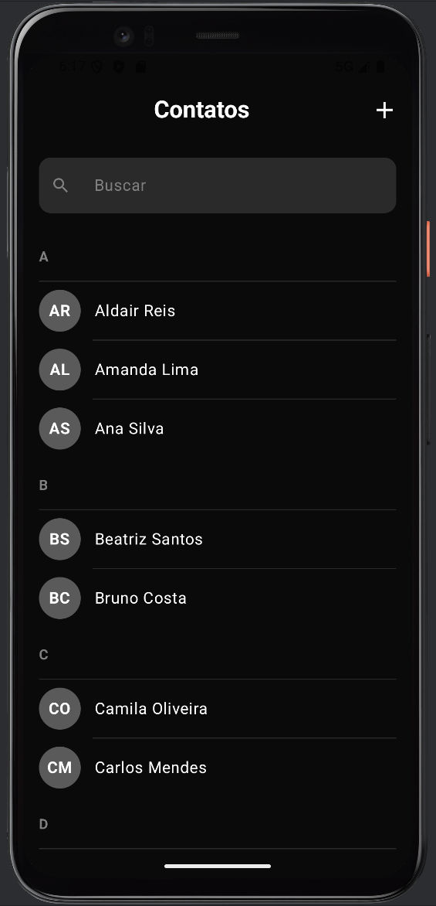
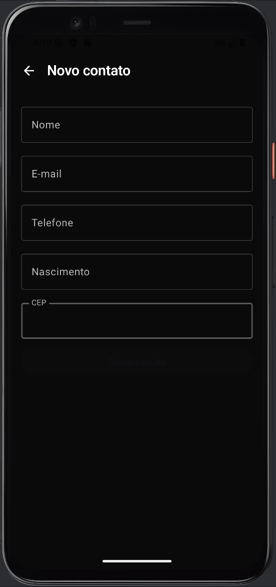
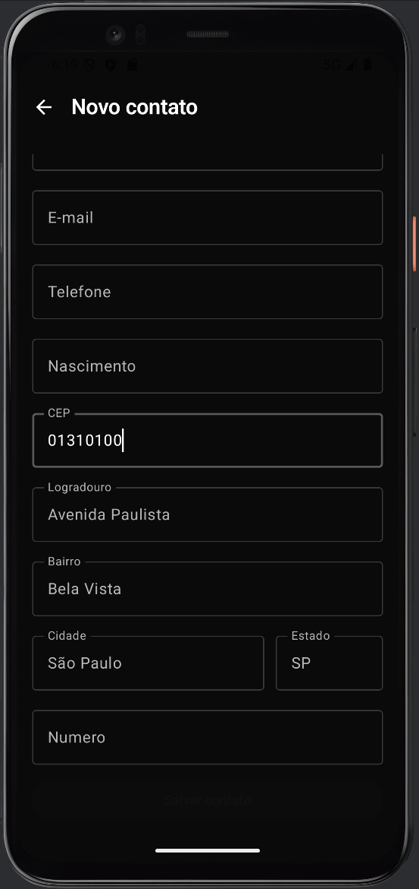
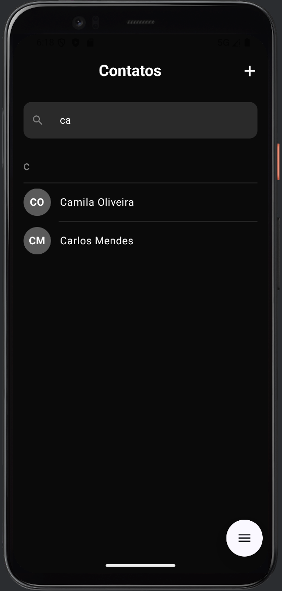
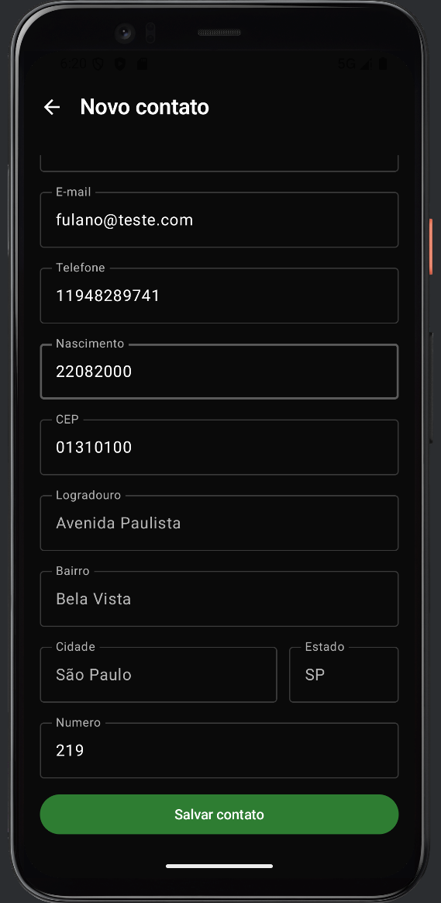
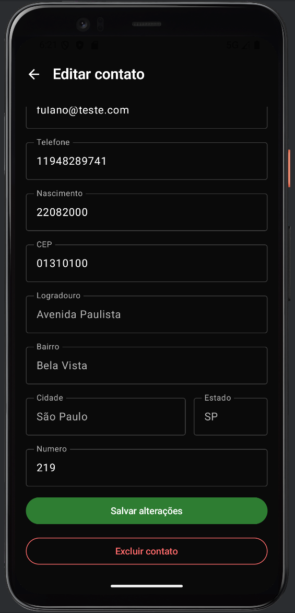

# 📱 Gerenciador de Contatos

Aplicativo Android desenvolvido em **Kotlin** com **Jetpack Compose**, com persistência local via **Room (SQLite)** e consulta automática de endereço pela **API ViaCEP**.

---

## 🖼️ Telas do Aplicativo

### Fluxo Principal

| Tela Inicial | Cadastro de Contato | Preenchimento Automático (CEP) |
|:-:|:-:|:-:|
|  |  |  |

### Operações com Contatos

| Busca de Contato | Salvar Contato | Editar / Excluir |
|:-:|:-:|:-:|
|  |  |  |

---

## ✨ Funcionalidades

- ✅ **Listar** todos os contatos em ordem alfabética
- ✅ **Buscar** contatos pelo nome em tempo real
- ✅ **Criar** novo contato com 10 campos
- ✅ **Editar** contato existente
- ✅ **Excluir** contato com confirmação
- ✅ **Consulta automática de endereço** pelo CEP via API ViaCEP
- ✅ **Iniciais geradas automaticamente** a partir do nome
- ✅ **Persistência local** — dados salvos mesmo após fechar o app

---

## 🗂️ Campos do Contato

| Campo | Descrição |
|---|---|
| Nome | Nome completo |
| Iniciais | Geradas automaticamente (ex: "RA") |
| E-mail | Endereço de e-mail |
| Telefone | Número com DDD |
| Data de Nascimento | Formato DD/MM/AAAA |
| CEP | Preenchimento automático de endereço |
| Logradouro | Rua/Avenida (preenchido via CEP) |
| Número | Número do imóvel |
| Bairro | Bairro (preenchido via CEP) |
| Cidade / Estado | Preenchido via CEP |

---

## 🏗️ Arquitetura

O projeto segue o padrão **MVVM (Model-View-ViewModel)**:

```
UI (Compose Screens)
    ↓
ViewModel  ←→  Repository
                   ↓              ↓
               Room DAO       ViaCEP API
               (SQLite)       (Retrofit)
```

### Estrutura de Pacotes

```
gerenciadorcontatos/
├── model/
│   ├── Contact.kt              # Entidade Room
│   └── ViaCepAddress.kt        # Objeto de endereço
├── database/
│   ├── ContactDao.kt           # Operações no banco (CRUD)
│   └── ContactDatabase.kt      # Configuração do Room
├── network/
│   ├── RetrofitInstance.kt     # Configuração do Retrofit
│   ├── ViaCepService.kt        # Interface da API
│   └── ViaCepResponse.kt       # DTO da resposta ViaCEP
├── repository/
│   └── ContactRepository.kt    # Camada de dados
├── viewmodel/
│   └── ContactViewModel.kt     # Lógica de apresentação
├── ui/
│   ├── screens/
│   │   ├── ContactsListScreen.kt
│   │   ├── CreateContactScreen.kt
│   │   └── EditContactScreen.kt
│   ├── components/
│   │   ├── ContactItem.kt      # Card do contato na lista
│   │   └── SearchBar.kt        # Barra de busca
│   └── theme/                  # Cores, tipografia e tema
└── MainActivity.kt
```

---

## 🛠️ Tecnologias Utilizadas

| Tecnologia | Versão | Uso |
|---|---|---|
| Kotlin | 2.0.21 | Linguagem principal |
| Jetpack Compose | BOM 2024.09.00 | Interface declarativa |
| Material3 | — | Design system |
| Room | 2.7.0 | Banco de dados local (SQLite) |
| ViewModel | — | Gerenciamento de estado |
| Retrofit | 2.11.0 | Consumo da API REST |
| Gson | — | Deserialização JSON |
| Coroutines | — | Operações assíncronas |

---

## 🌐 API Utilizada

**ViaCEP** — consulta gratuita de endereços brasileiros por CEP.

```
GET http://viacep.com.br/ws/{cep}/json
```

Ao digitar o CEP no formulário, os campos de logradouro, bairro, cidade e estado são preenchidos automaticamente.

---

## 🚀 Como Executar

### Pré-requisitos
- Android Studio Hedgehog ou superior
- JDK 17+
- Emulador Android (API 24+) ou dispositivo físico

### Passos

```bash
# 1. Clone o repositório
git clone https://github.com/seu-usuario/gerenciadorcontatos.git

# 2. Abra no Android Studio
# File → Open → selecione a pasta do projeto

# 3. Sincronize o Gradle
# File → Sync Project with Gradle Files

# 4. Execute
# Clique em Run 'app' (▶)
```

---

## 📦 Banco de Dados

- **Tecnologia:** Room (abstração sobre SQLite)
- **Versão do schema:** 2
- **Tabela:** `contacts`
- **Estratégia de migração:** `fallbackToDestructiveMigration` (recria o banco em mudanças de schema)
- **Dados iniciais:** 3 contatos inseridos automaticamente na primeira execução

---

## 🔒 Configurações de Rede

O app requer permissão de Internet e permite tráfego HTTP para o domínio `viacep.com.br` (necessário no emulador Android):

```xml
<uses-permission android:name="android.permission.INTERNET" />
```

---

## 👨‍💻 Desenvolvido por

**Rafael Alexandre Gracas**  
Curso de Desenvolvimento de Software — Proway  
2025/2026
