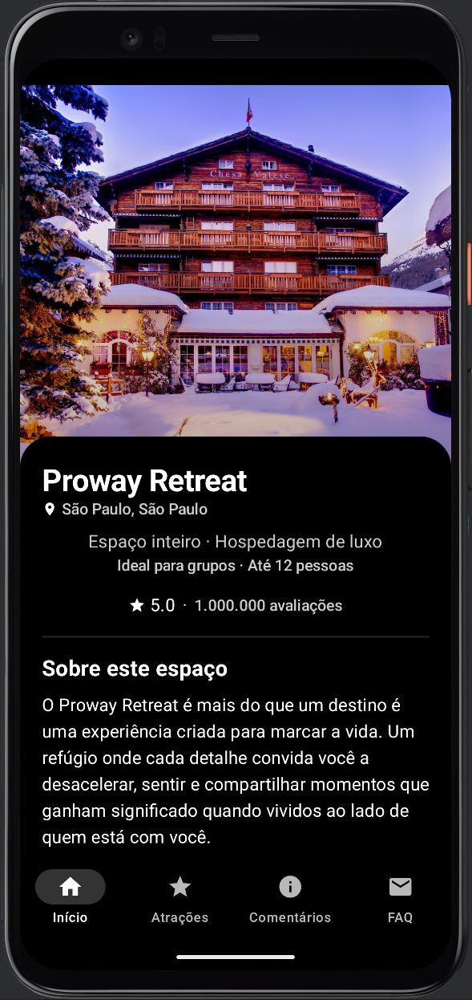
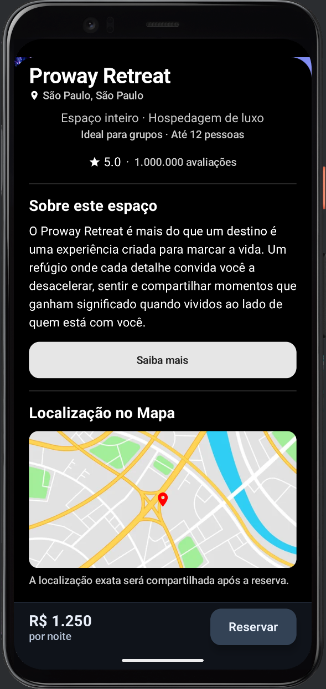
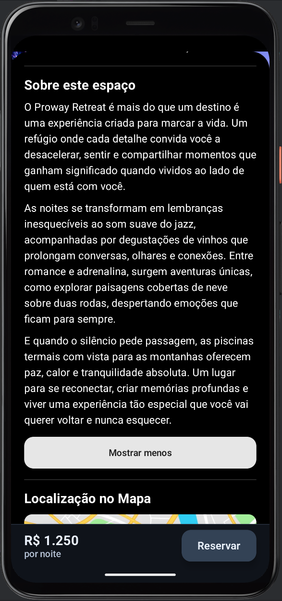
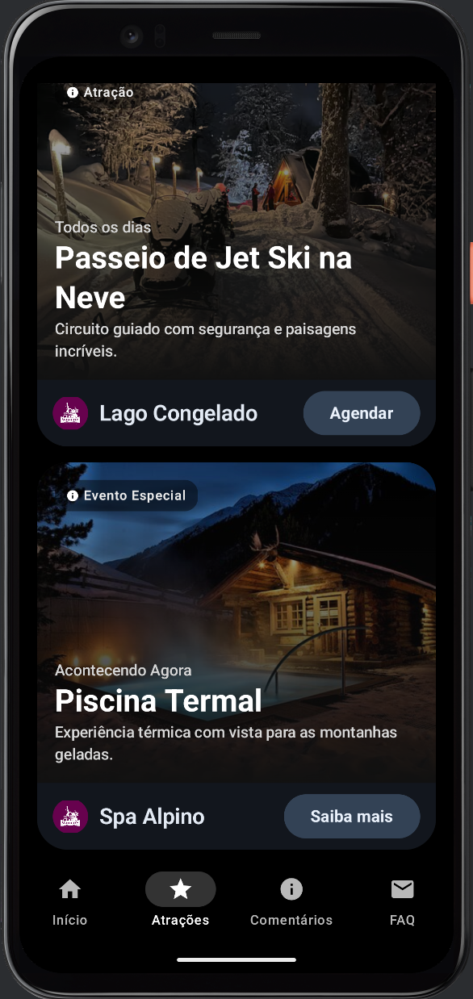
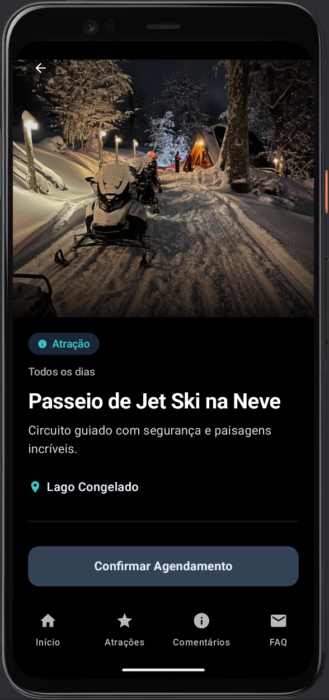
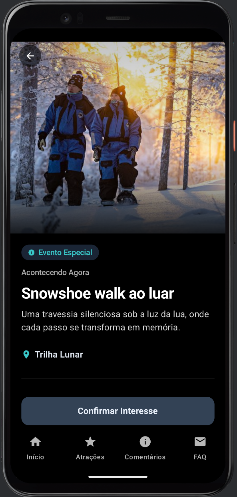
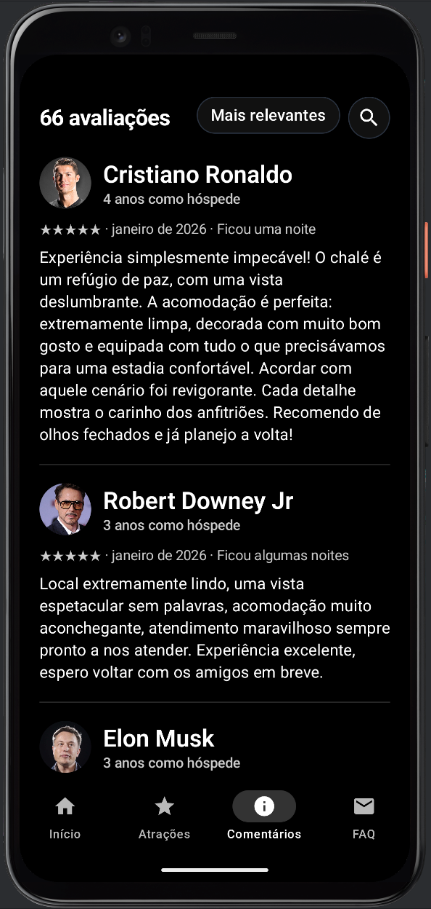
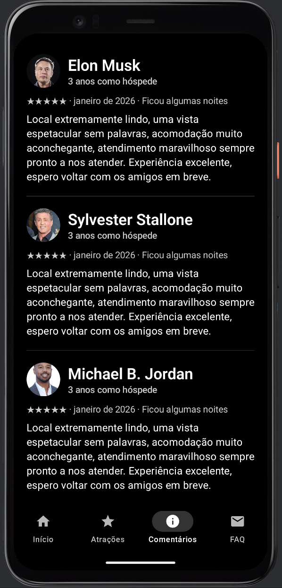
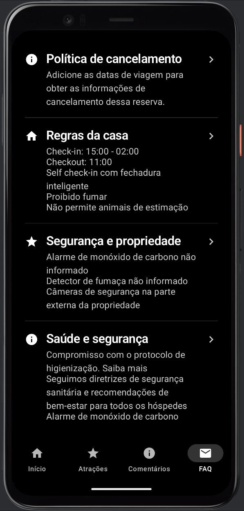

# 🏨 Sistema Hospedagem — Proway Retreat

Aplicativo Android desenvolvido em **Kotlin** com **Jetpack Compose**, focado em uma experiência de hotelaria com navegação entre páginas de **Início**, **Atrações**, **Comentários** e **Dúvidas Frequentes**.

---

## 🖼️ Telas do Aplicativo

### 🏠 Tela Inicial

| Página Inicial | Informações da Hospedagem | Expandir Conteúdo |
|:-:|:-:|:-:|
|  |  |  |
| Hero image com resumo visual | Bottom sheet com informações, mapa e descrição | Ação de expansão com animação |

---

### 🎭 Tela de Atrações

| Lista Principal | Segunda Visualização | Terceira Visualização |
|:-:|:-:|:-:|
|  |  |  |
| Primeiros cards de atrações | Continuação da lista | Mais atrações disponíveis |

#### Detalhes dos Cards de Evento

| Card 1 | Card 2 |
|:-:|:-:|
|  |  |
| Detalhe de card com informações | Outro card com detalhes de evento |

---

### 💬 Tela de Comentários

| Avaliações - Primeira Parte | Avaliações - Segunda Parte |
|:-:|:-:|
|  |  |
| Perfil, estrelas e texto dos hóspedes | Continuação das avaliações |

---

### ❓ Tela de FAQ



**Perguntas frequentes organizadas em 4 categorias:**
- Cancelamento
- Regras
- Segurança
- Saúde

---

## ✨ Funcionalidades

- ✅ Navegação por menu inferior entre as 4 páginas principais
- ✅ Tela inicial com hero, resumo do espaço, mapa e CTA de reserva
- ✅ Bottom sheet expansível na tela de início com informações do espaço
- ✅ Lista com **20 atrações/eventos** em formato de cards interativos
- ✅ Acesso a **tela de detalhes** ao interagir com cada item da lista
- ✅ Exibição das informações completas da atração selecionada
- ✅ Botões contextuais: "Agendar" para atrações e "Saiba mais" para eventos
- ✅ Integração com Google Maps — clique no mapa abre a localização
- ✅ Seção de comentários com **avaliações** de hóspedes
- ✅ Seção de dúvidas frequentes com 4 categorias (cancelamento, regras, segurança, saúde)
- ✅ Rodapé dinâmico de reserva ao expandir o conteúdo inicial
- ✅ Preço dinâmico exibido: **R$ 1.250 por noite**
- ✅ Animações suaves com transições (fade, slide)

---

## 🗂️ Dados das Atrações

Cada item da listagem de atrações contém informações como:

| Campo | Descrição |
|---|---|
| Tipo | Classificação do item (Atração ou Evento) |
| Badge | Selo de destaque exibido no card |
| Título da seção | Contexto do item (ex: Disponível Agora) |
| Título | Nome principal da atração |
| Subtítulo | Descrição curta da experiência |
| Local | Espaço/ambiente onde ocorre |
| Imagem | Recurso visual utilizado no card e no detalhe |

---

## 💬 Comentários

A seção de comentários exibe avaliações de hóspedes com:
- Nome do hóspede
- Tempo como hóspede
- Data e duração da estadia
- Avaliação em estrelas (★★★★★)
- Texto descritivo completo
- Foto do perfil (com moldura circular)

**Total: 66 avaliações** (5 exibidas como amostra)

---

## 📋 Seções do FAQ

1. **Política de cancelamento** — informações sobre cancelamento de reserva
2. **Regras da casa** — check-in, checkout, proibições e restrições
3. **Segurança e propriedade** — sistemas de segurança e monitoramento
4. **Saúde e segurança** — protocolos de higienização e bem-estar

---

## 🏗️ Arquitetura

O projeto utiliza uma estrutura direta com navegação Compose e estado compartilhado:

```text
AppNavigation (NavHost + Estado Compartilhado)
    |
    +-- BottomMenu (Menu de Navegação)
    +-- AnimatedVisibility (Menu ↔ Rodapé de Reserva)
    |
    +-- TelaHeroComBottomSheet (Início)
    |   ├── BottomSheetScaffold (Expandível)
    |   └── BottomBarReserva (Rodapé dinâmico)
    |
    +-- TelaAtracoes (Listagem)
    |   └── CardAtracao × 20 (Cards interativos)
    |
    +-- TelaDetalheAtracao (Detalhes)
    +-- TelaComentarios (Avaliações)
    |   └── ComentarioItem × 5
    |
    +-- TelaFaq (Dúvidas)
        └── FaqSecaoItem × 4
```

### Componentes Principais

- **CardAtracao**: Card com imagem, informações resumidas, botão contextual (Agendar/Saiba mais)
- **ComentarioItem**: Perfil, avaliação, data e texto do comentário
- **FaqSecaoItem**: Ícone, título e lista de detalhes expansível
- **BottomBarReserva**: Preço por noite e botão de reserva flutuante

### Estrutura de Pacotes

```text
app/src/main/java/com/example/sistemahospedagem/
├── MainActivity.kt              # Navegação, telas e componentes do app
└── ui/theme/
    ├── Color.kt                 # Paleta de cores (tema escuro)
    ├── Theme.kt                 # Tema Material3 com darkTheme = true
    └── Type.kt                  # Tipografia customizada
```

### Data Classes

```kotlin
data class AtracaoUi(
    val tipo: TipoAtracao,        // ATRACAO ou EVENTO
    val badge: String,
    val tituloSecao: String,
    val titulo: String,
    val subtitulo: String,
    val jogo: String,             // Nome do espaço/local
    val imagem: Int               // Referência de drawable
)

data class ComentarioUi(
    val nome: String,
    val tempoComoHospede: String,
    val resumo: String,
    val texto: String,
    val foto: Int
)

data class FaqSecaoUi(
    val icone: ImageVector,
    val titulo: String,
    val detalhes: List<String>
)
```

---

## 🛠️ Tecnologias Utilizadas

| Tecnologia | Versão | Uso |
|---|---|---|
| Kotlin | 2.0.21 | Linguagem principal |
| Android Gradle Plugin | 8.9.2 | Build do app Android |
| Jetpack Compose | BOM 2024.09.00 | Interface declarativa |
| Material3 | via BOM | Design system (tema escuro) |
| Navigation Compose | 2.9.7 | Navegação entre telas com NavHost |
| Activity Compose | 1.13.0 | Integração Activity + Compose |
| Lifecycle Runtime KTX | 2.10.0 | Ciclo de vida e runtime |
| Core KTX | 1.18.0 | Extensões Android |
| Compose Animation | via BOM | Transições suaves (fadeIn, slideIn) |

### Recursos Especiais

- **Bottom Sheet Expansível**: `BottomSheetScaffold` com estado compartilhado
- **Animações**: `AnimatedVisibility` com `fadeIn/fadeOut` e `slideInVertically/slideOutVertically`
- **Navigation Navega** entre telas mantendo estado
- **Google Maps Integration**: Uso de `Intent` para abrir localização no Maps
- **Tema Escuro**: Material3 com `darkTheme = true` em toda a aplicação

---

## 🚀 Como Executar

### Pré-requisitos
- Android Studio Hedgehog ou superior
- JDK 11+
- Emulador Android (API 24+) ou dispositivo físico

### Passos

```bash
# 1. Clone o repositório
git clone https://github.com/seu-usuario/proway-retreat.git

# 2. Acesse a pasta do projeto
cd SistemaHospedagem

# 3. Abra no Android Studio
# File -> Open -> selecione a pasta do projeto

# 4. Sincronize o Gradle
# File -> Sync Project with Gradle Files

# 5. Execute
# Clique em Run 'app' (▶)
```

---

## 📦 Build de Release

- O projeto suporta assinatura de release via `local.properties`.
- Se as chaves de release nao estiverem configuradas, o build de release usa assinatura de debug para manter o APK instalavel em ambiente local.
- Saida esperada do APK de release:

```text
app/build/outputs/apk/release/app-release.apk
```

---

## � Fluxo de Estado

O app mantém um **estado compartilhado** entre as telas:

```kotlin
val modoReservaAtivo = remember { mutableStateOf(false) }
```

- Quando o bottom sheet da tela inicial é expandido: `modoReservaAtivo.value = true`
- O menu padrão desaparece com `fadeOut()`
- O rodapé de reserva aparece com `slideInVertically()`
- Ao recolher: transição inversa

---

## 🗺️ Navegação entre Telas

| Rota | Componente | Descrição |
|---|---|---|
| `lista` | `TelaHeroComBottomSheet` | Tela inicial com hero image |
| `atracoes` | `TelaAtracoes` | Lista de 20 atrações/eventos |
| `detalhe_atracao` | `TelaDetalheAtracao` | Detalhes da atração selecionada |
| `comentarios` | `TelaComentarios` | Avaliações de hóspedes |
| `faq` | `TelaFaq` | Perguntas frequentes |

---

## �📌 Requisitos do Desafio Atendidos

- Sistema tematico de hotelaria/resort: **Proway Retreat**
- Tela inicial com informacoes de endereco, conteudo promocional e reserva
- Pagina de atracoes com colecao de 20 itens
- Interacao com item para abrir tela de detalhes
- Pagina de comentarios
- Pagina de duvidas frequentes

---

## 👨‍💻 Desenvolvido por

**Rafael Alexandre Gracas**  
Curso de Desenvolvimento de Software — Proway  
2025/2026
